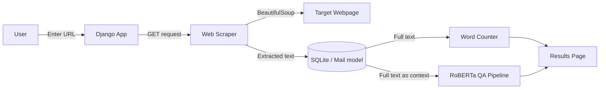

# FSD — Full-Stack Django Web Platform 🕸️

A Django-based full-stack web application that lets users crawl any webpage, extract its full text, analyse word frequencies, and interact with the content via a built-in QA chatbot powered by a transformer model.

---

## What this project does

Paste a URL → the app scrapes the page, stores the content, and gives you three capabilities:

1. **Word frequency analysis** — ranked word counts extracted from the scraped text.
2. **QA chatbot** — ask natural-language questions about the page; answers are generated by a `deepset/roberta-base-squad2` extractive QA model.
3. **HTML source preview** — view the raw HTML of any crawled page.

---

## Tech stack

| Layer | Technology |
|---|---|
| Web framework | Django 4.x |
| NLP / QA model | HuggingFace Transformers (`deepset/roberta-base-squad2`) |
| Web scraping | `requests` + `BeautifulSoup4` |
| Text analysis | Python `collections.Counter` |
| Database | SQLite (Django default) |
| Templating | Django Templates (HTML) |
| Server | WSGI / ASGI ready |

---

## High-level architecture



---

## Repository layout

```
FSD/
├── manage.py                  # Django project runner
├── web_crawler/               # Django project config
│   ├── settings.py
│   ├── urls.py                # Root URL routing
│   ├── wsgi.py
│   └── asgi.py
├── wordcounter/               # Main Django app
│   ├── views.py               # Core logic: scraping, QA, word count
│   ├── models.py              # Mail model — stores URL + scraped text
│   ├── forms.py               # URL input form
│   ├── urls.py                # App-level URL routing
│   ├── admin.py               # Django admin registration
│   └── migrations/            # DB migrations
└── templates/                 # HTML templates (home, result)
```

---

## Core features (from the code)

### Web scraping
Uses `requests` to fetch any URL and `BeautifulSoup` to extract clean text from the full page. Scraped text and URL are persisted in the `Mail` model (SQLite) to avoid duplicate requests.

### Word frequency counter
After scraping, `collections.Counter` tokenises and counts all words (lowercased, punctuation stripped), returning a ranked frequency list rendered on the results page.

### Transformer-powered QA
Integrates HuggingFace `pipeline("question-answering")` with `deepset/roberta-base-squad2`. The scraped page text is used as context; the user's question is answered extractively. If no valid answer is found, the app returns a graceful fallback message.

---

## Quickstart

### 1. Clone and create environment

```bash
git clone https://github.com/vimal-crypto/FSD.git
cd FSD
python -m venv .venv

# Windows
.venv\Scripts\activate

# Linux / Mac
source .venv/bin/activate
```

### 2. Install dependencies

```bash
pip install django requests beautifulsoup4 transformers torch
```

### 3. Apply migrations and run

```bash
python manage.py migrate
python manage.py runserver
```

Open `http://127.0.0.1:8000` in your browser.

---

## Usage flow

1. Enter any public URL on the home page.
2. Click **Scrape** — the app fetches and stores the page content.
3. View **word frequency analysis** on the results page.
4. Use the **chat box** to ask questions about the page content.

---

## Design decisions

- **SQLite persistence** — scraped pages are cached by URL so repeat visits skip re-scraping.
- **Extractive QA over generative** — RoBERTa SQuAD2 gives precise, grounded answers directly from the page text.
- **Django session-based chat history** — conversation turns are kept per-session without a separate store.

---

## Roadmap

- [ ] Add `requirements.txt` with pinned versions
- [ ] Add pagination for word frequency table
- [ ] Support multi-page crawling
- [ ] Add unit tests (`tests.py` scaffold is ready)
- [ ] Dockerise the app
- [ ] Deploy to Railway / Render

---

## License

MIT

---

## Maintainer

**Vimal Dharan**
GitHub: [vimal-crypto](https://github.com/vimal-crypto)
